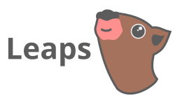
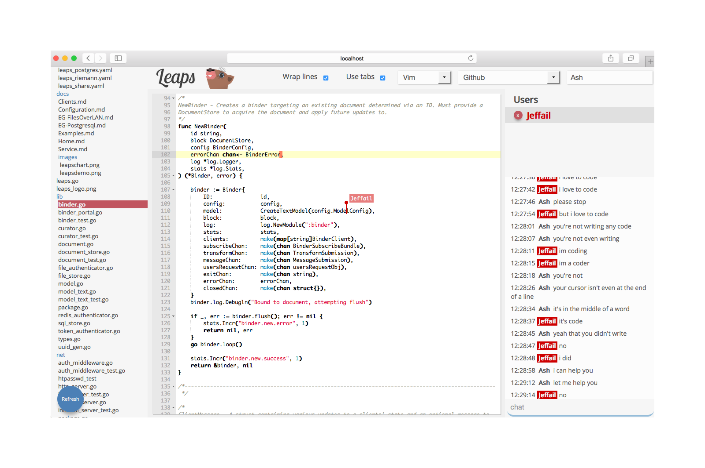

Leaps is a service for collaboratively editing your local files over a web UI,
using operational transforms to ensure zero-collision synchronization across any
number of editing clients.

Simply navigate to a directory you want to share, run `leaps`, open the hosted
page in your browser and direct any friends on your LAN to the same page. You
can now collectively edit any documents in that directory.



Leaps can also be used as a library, with implementations of accessors for
various document hosting solutions and plugable authentication layers, allowing
you to build your own services to suit many service architectures.

Leaps server components are implemented in Golang, and has a client implemented
in JavaScript that can currently be used with ACE, CodeMirror and Textarea
editors.

To read more about the service library components and find examples check out
the [godocs][1].

To read about the JavaScript client check out the [README][2].

## Install

Leaps is a single binary, with no runtime dependencies. Just download a package
for your OS from [the latest releases page][3].

### From homebrew

```bash
brew install leaps
leaps -h
```

### Build with Go

```bash
go get github.com/jeffail/leaps/cmd/...
leaps -h
```

## Vendoring

Versions of go above 1.6 should automatically `go get` all vendored libraries.
Otherwise, while cloning use `--recursive`:

`git clone https://github.com/jeffail/leaps --recursive`

Or, if the repo is already cloned, get the latest libraries with:

`git submodule update --init`

To add new libraries simply run:

```
PACKAGE=github.com/jeffail/util
git submodule add https://$PACKAGE vendor/$PACKAGE"
```

It might be handy to set yourself a function for this in your `.bashrc`:

```bash
function go-add-vendor {
    git submodule add https://$1 vendor/$1
}
```

## System compatibility

OS               | Status
---------------- | ------
OSX x86_64       | Supported, tested
Linux x86        | Supported, tested
Linux x86_64     | Supported, tested
Linux ARMv5      | Supported, tested
Linux ARMv7      | Supported, tested
Windows x86      | Supported
Windows x86_64   | Supported

## Contributing and customizing

Contributions are very welcome, just fork and submit a pull request.

## Contact

Ashley Jeffs
* Web: [http://jeffs.eu](http://jeffs.eu)
* Twitter: [@Jeffail](https://twitter.com/Jeffail "@jeffail")
* Email: [ash@jeffs.eu](mailto:ash@jeffs.eu)

[1]: https://godoc.org/github.com/Jeffail/leaps
[2]: client/README.md
[3]: https://github.com/Jeffail/leaps/releases/latest
