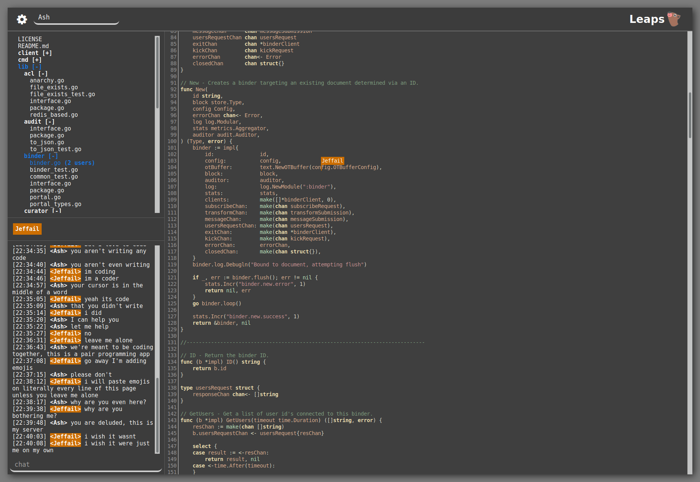

[![godoc for jeffail/leaps][4]][5]
[![goreportcard for jeffail/leaps][6]][7]

Leaps is a service for collaboratively editing your local files over a web UI,
using operational transforms to ensure zero-collision synchronization across any
number of editing clients.

WARNING: This project is no longer actively maintained.



## Run

Simply navigate to a directory you want to share, run `leaps`, open the hosted
page (default `http://localhost:8080`) in your browser and direct any friends on
your LAN to the same page. You can now collaboratively edit any documents in
that directory.

Your files will be written to in the background as you edit. If you aren't using
version control, or simply want extra protection, you can run leaps in safe mode
with the `--safe` flag. In safe mode any changes you make will be placed in a
`.leaps_cot.json` file, which you can then apply to your files once you are
happy by running with the `--commit` flag.

### Build/test commands from the UI

When writing code it sucks to have to leave the editor for running tests,
linters or builds. However, allowing the internet to run arbitrary commands on
the host machine is a recipe for disaster.

Instead, leaps allows you to specify pre-written commands using the `-cmd` flag,
which are then available for clients to trigger asynchronously while they edit.
Results are broadcast to all connected users, so you can all see the outcome as
a team.

For example, `leaps -cmd "golint ./..." -cmd "go build ./cmd/leaps"` gives
users both a linter and a build command that they can trigger on your machine.

## API

Leaps can also be used as a library, with implementations of accessors for
various document hosting solutions and plugable authentication layers, allowing
you to build your own services to suit many service architectures.

Leaps server components are implemented in Golang, and has a client implemented
in JavaScript that can currently be used with ACE, CodeMirror and Textarea
editors.

To read more about the service library components and find examples check out
the [godocs][1].

To read about the JavaScript client check out the [README][2].

## Install

Leaps is a single binary, with no runtime dependencies. Just download a package
for your OS from [the latest releases page][3].

### From homebrew

``` sh
brew install leaps
leaps -h
```

### Build with Go

``` sh
go get github.com/Jeffail/leaps/cmd/...
leaps -h
```

## System compatibility

OS                 | Status
------------------ | ------
OSX `x86_64`       | Supported, tested
Linux `x86`        | Supported
Linux `x86_64`     | Supported, tested
Linux `ARMv5`      | Builds
Linux `ARMv7`      | Supported, tested
Windows `x86`      | Builds
Windows `x86_64`   | Builds

## Contributing and customizing

Contributions are very welcome, just fork and submit a pull request.

## Contact

Ashley Jeffs
* Web: [http://jeffail.uk](http://jeffail.uk)
* Twitter: [@Jeffail](https://twitter.com/Jeffail "@jeffail")

[1]: https://godoc.org/github.com/Jeffail/leaps
[2]: client/javascript/README.md
[3]: https://github.com/Jeffail/leaps/releases/latest
[4]: https://godoc.org/github.com/Jeffail/leaps?status.svg
[5]: http://godoc.org/github.com/Jeffail/leaps
[6]: https://goreportcard.com/badge/github.com/Jeffail/leaps
[7]: https://goreportcard.com/report/jeffail/leaps
